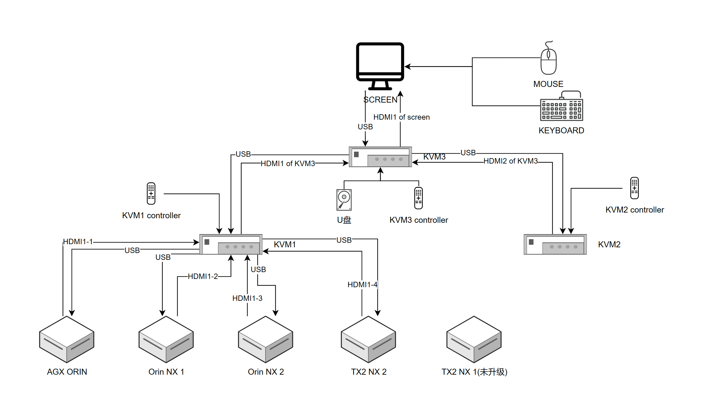

## Jetson

Nidia Jetson 配置进度以及踩过的坑

#### 连接图



#### 现状

- AGX ORIN Flower get
- Orin NX 1 Flower get
- Orin NX 2 Flower get
- TX2 NX 1 toooo old version
- TX2 NX 2 too old version

#### 进展

- 新进展：数据集传输成功，superlink连接成功。
- 新问题：启动训练报错，提示method not found，可能为flower版本不匹配
- 尝试解决：目前agx的flower可能是1.14，但两台orin nx的确定为1.15，尝试更新agx的版本
- 新问题：agx的系统版本不支持1.15 flower。
- 尝试解决：上虚拟机刷机
- 新进展：已更新，已经装上
- 新问题：已连接，但跑不起来
- 新进展：numpy不兼容但无提示，已解决，已经跑起来
- 待办：看看低版本的其他机器能不能跑

#### 踩过的坑

- 设备不要随便买。Ubuntu arm 的兼容性很差，一般的硬件不一定兼容。最好用商家给的，让商家装好或者给教程。
- 给 Orin NX 买了常用的网卡。然后死都找不到驱动。实在受不了了打算手动编译。成功玩黑屏，开机卡在系统引导界面。
- 借鉴给 PC 装机的经验，把同一型号的正常设备硬盘备份下来，打算直接刷硬盘回滚。没想到同一型号的硬盘数据完全不通，这回连系统引导都进不去了。
- 开虚拟机用 NV 官方的工具连线刷机。万事俱备，把线连上，嘿，根本没反应。得，返厂吧。
- 然后转战 TX2 NX。发现版本太老跑不了 Flower，随打算升级。神奇的 Jetson 嘿，内核出问题了。好在我事前备份了全硬盘数据，刷硬盘回滚。
- 神奇的是 TX2 NX 同型号不同设备的全盘数据通用，反反复复刷盘备份了很多遍。
- 以为是更新源的问题。把源设置为 Nvidia 源唯一，然后更新，嘿，内核还是有问题。
- 再次回滚。折腾半天发现环境更新了，内核还留在老版本。尝试各种命令行升级内核，无果。实在受不了了打算手动编译内核头文件，无果。
- 最后，开虚拟机用 NV 官方的工具给连线刷机。成功。
- 发现并没有什么用。TX2 NX 最新的版本还是太老。
- 还是先转战 Orin NX 吧家人们。

#### 注意事项

Ubuntu arm 的兼容性很差。

设备不要随便买。Ubuntu arm 的兼容性很差，一般的硬件不一定兼容。最好用商家给的，让商家装好或者给教程。

可以搞全硬盘备份。把硬盘拆下来，插硬盘盒里连主机，把数据全都备份下来。配环境的时候，到了关键点备份一次。不同设备的数据不一定通用，但本机的一定可以。

Jetson TX2 NX 不要随意升级：
- sudo apt update 更新软件包索引可以，但不要随意 sudo apt upgrade 更新软件包
- Jetson TX2 NX 的原装存储是一片16G的EMMC。但很明显这不够用。所以开发板给它配了nvme硬盘。
- 在第一次使用时，需要按照教程把系统挂到nvme硬盘上。
- 但当我尝试 sudo apt upgrade 的时候，出现的非常吊诡的现象是，包括 Jetpack 在内的所有系统环境都更新到了337版本。
- 但仍有报错。当我检查系统版本时，teminal 告诉我，当前是337版本。
- 那为什么报错呢。好一番鼓捣，发现尽管所有环境都更新到了337，嘿你猜怎么着，内核还在294.
- 所以究极诡异的情况是内核和系统环境不匹配了，干啥啥不行。
- 大概是因为内核还在emmc上？或者单纯就是 Jetson 兼容性不行，无法升级。
- 最后的解决方法是开一个x86 Ubuntu 虚拟机，用 NVIDIA 的软件连线刷机。又是个麻烦事。
- 所以只要能跑，不要升级。
- 需要升级的话，升级指定的包，不要升级系统。
- 非要升级系统，那就直接连线刷机。刷机方法直接问GPT。刷机时连跳线小心点，别冒烟了。
- 不要问我为什么小心冒烟。
- 当然之后大概率也不需要更新系统了。TX2 太老了，目测已经停更。

Jetson Orin NX 不要随意升级：
- sudo apt update 更新软件包索引可以，但不要随意 sudo apt upgrade 更新软件包
- 因为当　sudo apt upgrade　之后，就会见到这个：
```
Cleaning up the temporary directory for updating the initrd..
Errors were encountered while processing:
 nvidia-l4t-kernel
 nvidia-l4t-kernel-headers
 nvidia-l4t-jetson-io
 nvidia-l4t-kernel-oot-modules
 nvidia-l4t-display-kernel
 nvidia-l4t-kernel-oot-headers
 nvidia-l4t-kernel-dtbs
E: Sub-process /usr/bin/dpkg returned an error code (1)
```
- 这意味着内核又出问题了。我没有查证这是因为什么，只知道在google上搜到了一堆类似的案例。
- 好在我有全硬盘数据备份。直接刷硬盘回滚了。
- 但又有一个问题：不同的设备哪怕是同一个型号，刷硬盘的数据不能互通。不要妄想用同型号的其他设备的硬盘数据回滚。不然喜提黑屏。
- 不知道为什么，Jetson Orin NX 连线刷机连不上。
